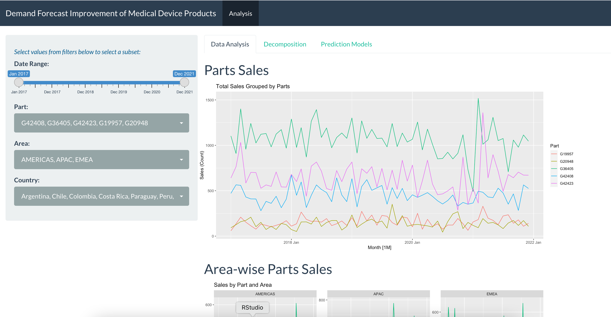

## Demand Forecast Improvement of Medical Device Products

This github page contains the code and input data for the [Demand Forecast Improvement of Medical Device Products App](https://uotdrt-abhijeet0malatpure.shinyapps.io/DS590_Project/) developed by Team 5 for the DS590 Time Series Final Project.

Input data are obtained by Heungseok Oh from his company and resides under /input_data as an Excel Spreadsheet.

## Shiny interface

Follow [this](https://uotdrt-abhijeet0malatpure.shinyapps.io/DS590_Project/) link for the interactive Shiny app. A screenshot of the interface is provided below.

## App Structure

The R Shiny application will have three main tabs- a) Analysis, for users to analyze data properties), b) Decomposition, to visualize decomposition graphs and c) Prediction, to view the various prediction models and their plots for future data. 

Users will be able to visualize the past sales for a specific product by choosing a Product, Area and/or Country from the sidebar, and can also analyze aggregated data across all areas and countries or choose a subset of values for each parameter. 

On the decomposition tab, users can choose to perform classical or STL decomposition and view the corresponding graphs for the chosen subset of data. 

The Prediction Model tab has three tabs for ARIMA, TSLM and ETS models that lets users see the predictions for the sales of these products.

## Other resources

- [Application Layout Guide. 01 February 2021](https://shiny.rstudio.com/articles/basics.html)
- [Bootswatch Flatly theme](https://bootswatch.com/flatly)

## Authors
- Abhi Malatpure
- Heungseok Oh
- Jeffrey French
